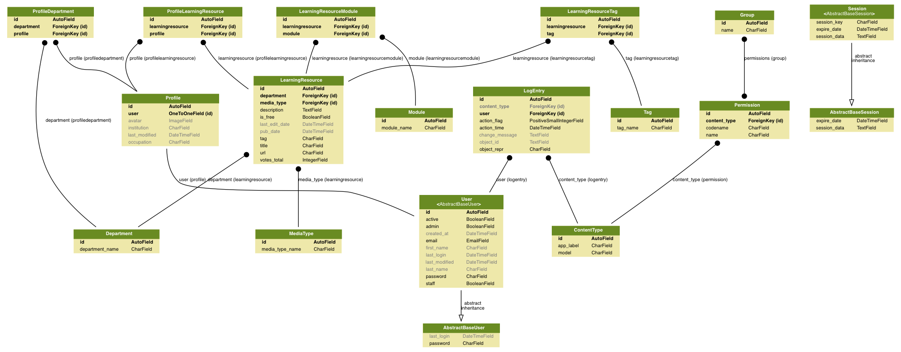
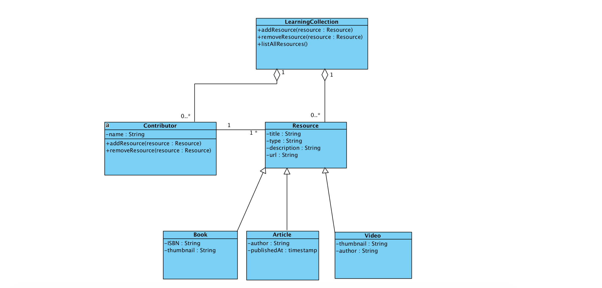

# Class Diagram

Current Diagram:

Previous Class diagram done during planning phase:

One Learning Collection can have 0 to many Resources. It can also have 0 to many Contributors. 

Book, Article and Video are subclasses \(they inherit\) of the Resource. 

