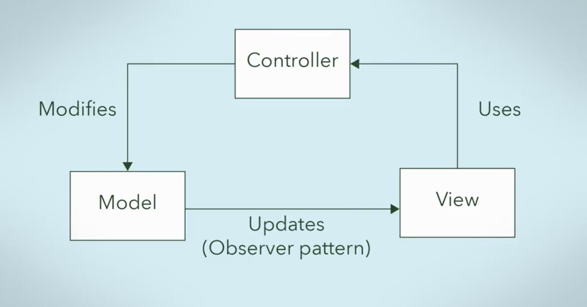

# MVC Pattern

## Model View Controller Design Pattern

_extracted from \[_[_https://developer.mozilla.org/en-US/docs/Learn/Server-side/Django/Introduction_](https://developer.mozilla.org/en-US/docs/Learn/Server-side/Django/Introduction)_\]_

Django uses the MVC pattern. It is a widely adopted pattern for user interface, such as Code Resource Center.

extracted from [https://www.coursera.org/learn/design-patterns/lecture/hvINx/2-3-1-mvc-pattern](https://www.coursera.org/learn/design-patterns/lecture/hvINx/2-3-1-mvc-pattern)

It relies heavily on the Separation of Concerns principle. The Model corresponds to Entity Objects,  a View corresponds to the Boundary Object that deals with users and Controller corresponds to the Control objects that receives events and coordinates actions.

**Notice:** 

* The View is an Observer of the Model. Model will "tell" View when a change has occurred and the view will update itself;
* The Model exists on its own. It doesn't rely on a View or Controller to exist;
* A View is the Observer \(subscriber\) and the Model is an Observable;
* The Controller is the "middleman".  It receives orders from the user and works with the Model based on those requests, and then delivers back to the frontend;
* They are loosely coupled.

Django uses this pattern, which follows the Separation of Concerns principle, making the software modular and loosely coupled. 

