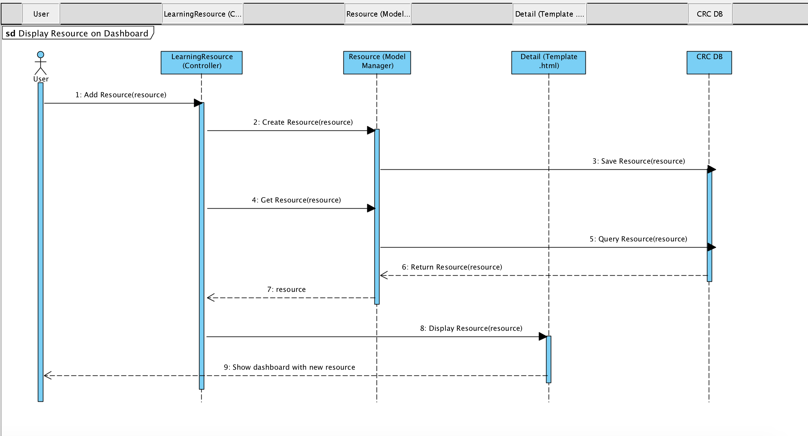

# Sequence Diagram

1. The User adds a resource by hitting the submit button.
2. The method create resource" on the LearningResource Controller is called. 
3. The Resource Model Manager is triggered to save the resource in the Database. \(`Manager` is the interface through which database query operations are provided to Django models. At least one `Manager` exists for every model in a Django application. More at [https://docs.djangoproject.com/en/2.1/topics/db/managers/](https://docs.djangoproject.com/en/2.1/topics/db/managers/) \)
4. The resource is saved on the database
5. The Resource Manager runs a query.
6. The query result goes to the Controller \(via Manager\).
7. The Controller triggers the template to display the data on the Detail page.
8. The user then, sees the data displayed on the browser. 

