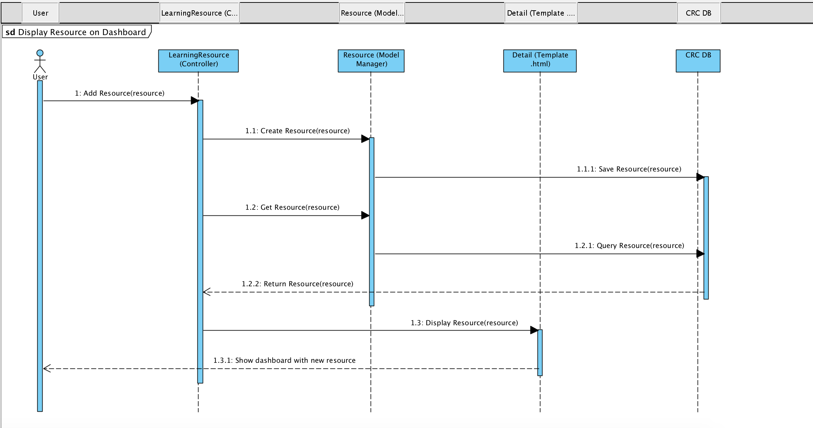

# Sequence Diagram

1. The User adds a resource by hitting the submit button.
2. The method create resource" on the LearningResource Controller is triggered. 
3. The Resource Model Manager is triggered to save the Resource in the Database. \(`Manager` is the interface through which database query operations are provided to Django models. At least one `Manager` exists for every model in a Django application. More at [https://docs.djangoproject.com/en/2.1/topics/db/managers/](https://docs.djangoproject.com/en/2.1/topics/db/managers/) \)  

